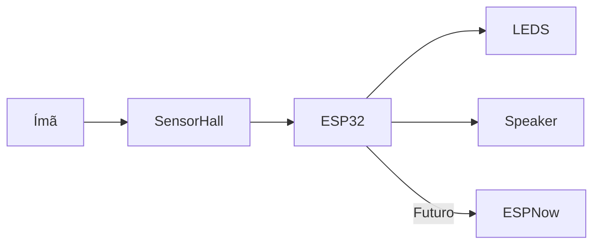

# 🤖🛡️ Alphonse Elric Cosplay – Sistema Eletrônico

  
  
  
  

---

## 🎭 Sobre o Projeto

Este repositório contém toda a parte eletrônica do cosplay do **Alphonse Elric**, com o objetivo de criar uma experiência **imersiva, interativa e tecnológica**.

A ideia vai além da estética: o projeto integra **sensores, LEDs, áudio e comunicação entre microcontroladores**, transformando o cosplay em um sistema embarcado completo.

---

## ⚡ Visão Geral do Sistema

---

## 📂 Estrutura do Repositório

### 🚀 `main` (Implementação Atual)

Código funcional do sistema.
| Arquivo                 | Descrição                  |
| ----------------------- | -------------------------- |
| `CodLuvas.ino`          | Cuida do sistema das Luvas |

### 🧲 Sensor Hall

* Detecta presença de ímã
* Gatilho principal do sistema
* ✅ **Implementado**

---

### 🌿 `testes`

Ambiente de experimentação e aprendizado.

| Arquivo                 | Descrição                  |
| ----------------------- | -------------------------- |
| `GetMacAdress.ino`      | Obtém MAC Address do ESP32 |
| `TestEspNowMestre.ino`  | Envia comandos via ESP-NOW |
| `TestEspNowEscravo.ino` | Recebe e executa comandos  |

---

### 💡 LEDs com efeito Fade

* Acendem ao detectar ímã
* Comportamento:

  * ⚡ Liga rápido
  * 🌙 Desliga devagar
* Mantém estado enquanto o ímã estiver presente
* ✅ **Implementado**

---

### 🔊 Speaker

* Usado para testes iniciais
* Ainda sem lógica final integrada
* ⚠️ **Parcialmente implementado**

---

## 🔩 Componentes Utilizados

| Componente        | Descrição                     |
| ----------------- | ----------------------------- |
| LED COB 5V        | Fonte de iluminação principal |
| Resistor 1kΩ      | Controle de sinal / proteção  |
| Resistor 10kΩ     | Pull-up / pull-down           |
| MOSFET IRLZ44N    | Controle de carga dos LEDs    |
| ESP32-C3          | Microcontrolador principal    |
| Sensor Hall A3144 | Detecção de campo magnético   |

---

## 🎥 Demonstrações

> 📌 Em breve:

* 📸 Fotos do hardware
* 🎬 Vídeos dos efeitos funcionando
* 🧩 Diagrama completo do sistema

---

## 🔧 Roadmap

### ✅ Já feito

* [x] Leitura de MAC Address
* [x] Testes com ESP-NOW
* [x] Integração Sensor Hall
* [x] Controle de LEDs com fade

### 🚧 Em desenvolvimento

* [ ] Sistema de áudio avançado (DFPlayer / PAM8403)
* [ ] Comunicação entre múltiplos ESPs
* [ ] Integração luvas ↔ corpo

### 🔮 Futuro

* [ ] Modos de operação (idle / combate / efeitos especiais)
* [ ] Feedback sonoro dinâmico
* [ ] Otimização de bateria
* [ ] Sistema modular expansível

---

## 🛠️ Tecnologias

* ESP32-C3
* Arduino IDE
* ESP-NOW
* Sensor Hall (A3144)
* PWM (controle de LEDs)
* Comunicação Serial

---

## 🧠 Diferenciais do Projeto

✔ Integração entre hardware e cosplay

✔ Sistema reativo ao ambiente (ímã)

✔ Estrutura pensada para expansão

✔ Base para sistemas distribuídos (ESP-NOW)

---

## 📸 Preview (em breve)

  
  <i>Luva Desativada</i>
  ![Prototipo 1.2](./imagens/Prototipo%201.2.jpeg
  <i>Luva Ativa</i>

---

## 👨‍💻 Autor

Diego Eduardo da Silva Santos

---

## ⭐ Contribuição

Ideias, melhorias e sugestões são muito bem-vindas!

---

## 🧪 Status do Projeto

> 🚧 Em desenvolvimento ativo
> Evoluindo constantemente conforme o progresso do cosplay

---