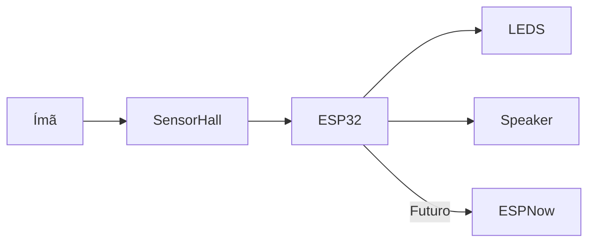

# 🤖🛡️ Alphonse Elric Cosplay – Sistema Eletrônico

<p align="center">
  
  
  
  
</p>

---

## 🎯 Propósito

Este projeto nasceu da vontade de unir **eletrônica embarcada com cultura geek**, criando um cosplay do Alphonse Elric (Fullmetal Alchemist) que vai além da aparência visual.

O sistema pode ser usado em:

- 🎪 **Eventos de cosplay e convenções** – efeitos visuais e sonoros reativos ao ambiente
- 🎓 **Projetos educacionais** – base prática para aprender ESP32, PWM, ESP-NOW e sensores
- 🔬 **Prototipagem de sistemas embarcados distribuídos** – comunicação entre múltiplos microcontroladores via ESP-NOW
- 🎮 **Props interativos** – qualquer projeto que precise de ativação por ímã com resposta em LED e áudio

---

## 🎭 Sobre o Projeto

Este repositório contém toda a parte eletrônica do cosplay do **Alphonse Elric**, com o objetivo de criar uma experiência **imersiva, interativa e tecnológica**.

A ideia vai além da estética: o projeto integra **sensores, LEDs, áudio e comunicação entre microcontroladores**, transformando o cosplay em um sistema embarcado completo.


---

## ⚡ Visão Geral do Sistema



---

## 🛠️ Pré-requisitos

### Hardware necessário

| Componente        | Descrição                     |
| ----------------- | ----------------------------- |
| LED COB 5V        | Fonte de iluminação principal |
| Resistor 1kΩ      | Controle de sinal / proteção  |
| Resistor 10kΩ     | Pull-up / pull-down           |
| MOSFET IRLZ44N    | Controle de carga dos LEDs    |
| ESP32-C3          | Microcontrolador principal    |
| Sensor Hall A3144 | Detecção de campo magnético   |
| Ímã permanente    | Gatilho do sensor Hall        |

### Software necessário

- [Arduino IDE](https://www.arduino.cc/en/software) (versão 2.x recomendada)
- Suporte ao ESP32 via Boards Manager:
  - Adicione a URL: `https://raw.githubusercontent.com/espressif/arduino-esp32/gh-pages/package_esp32_index.json`
  - Instale o pacote **esp32 by Espressif Systems**
- Nenhuma biblioteca externa adicional necessária para o código atual

### Como executar

1. Clone este repositório:
   ```bash
   git clone https://github.com/seu-usuario/seu-repositorio.git
   ```
2. Abra o arquivo `CodLuvas.ino` na Arduino IDE
3. Selecione a placa: **ESP32C3 Dev Module**
4. Selecione a porta COM correta
5. Faça o upload do código

---

## ⚠️ Erros Comuns e Soluções

### ESP32-C3 não aparece na lista de portas COM
> **Causa:** Driver USB não instalado.  
> **Solução:** Instale o driver [CH340](https://www.wch-ic.com/downloads/CH341SER_EXE.html) ou [CP210x](https://www.silabs.com/developers/usb-to-uart-bridge-vcp-drivers) conforme o chip USB do seu módulo.

### Erro ao fazer upload: "Failed to connect to ESP32-C3"
> **Causa:** O ESP32-C3 não entrou em modo de gravação.  
> **Solução:** Segure o botão **BOOT** enquanto pressiona **RESET**, depois solte o RESET e em seguida o BOOT. Tente o upload novamente.

### LEDs não acendem mesmo com o ímã presente
> **Causa:** Polaridade errada do ímã ou sensor Hall invertido.  
> **Solução:** Inverta o lado do ímã (o A3144 responde apenas ao polo Sul). Verifique também as conexões do MOSFET (Gate, Drain, Source).

### LED pisca de forma errática
> **Causa:** MOSFET ativando por ruído elétrico.  
> **Solução:** Confirme que o resistor de 10kΩ está conectado entre Gate e GND (pull-down).

### Código compila, mas ESP-NOW não funciona
> **Causa:** MAC Address incorreto ou canal Wi-Fi diferente entre os dispositivos.  
> **Solução:** Use o sketch `GetMacAdress.ino` para capturar o MAC exato de cada ESP32 e atualize no código do mestre.

---

## 📂 Estrutura do Repositório

### 🚀 `main` (Implementação Atual)

Código funcional do sistema.
| Arquivo                 | Descrição                  |
| ----------------------- | -------------------------- |
| `CodLuvas.ino`          | Cuida do sistema das Luvas |

### 🧲 Sensor Hall

* Detecta presença de ímã
* Gatilho principal do sistema
* ✅ **Implementado**

---

### 🌿 `testes`

Ambiente de experimentação e aprendizado.

| Arquivo                 | Descrição                  |
| ----------------------- | -------------------------- |
| `GetMacAdress.ino`      | Obtém MAC Address do ESP32 |
| `TestEspNowMestre.ino`  | Envia comandos via ESP-NOW |
| `TestEspNowEscravo.ino` | Recebe e executa comandos  |

---

### 💡 LEDs com efeito Fade

* Acendem ao detectar ímã
* Comportamento:

  * ⚡ Liga rápido
  * 🌙 Desliga devagar
* Mantém estado enquanto o ímã estiver presente
* ✅ **Implementado**

---

### 🔊 Speaker

* Usado para testes iniciais
* Ainda sem lógica final integrada
* ⚠️ **Parcialmente implementado**

---

## 🔌 Esquema Elétrico

<!-- Substitua a linha abaixo pela imagem do seu esquema elétrico -->
> 📌 *Diagrama em breve*

<!-- Exemplo de como inserir quando disponível:

-->

---

## 🎥 Demonstrações

> 📌 Em breve:

* 📸 Fotos do hardware
* 🎬 Vídeos dos efeitos funcionando
* 🧩 Diagrama completo do sistema

---

## 🔧 Roadmap

### ✅ Já feito

* [x] Leitura de MAC Address
* [x] Testes com ESP-NOW
* [x] Integração Sensor Hall
* [x] Controle de LEDs com fade

### 🚧 Em desenvolvimento

* [ ] Sistema de áudio avançado (DFPlayer / PAM8403)
* [ ] Comunicação entre múltiplos ESPs
* [ ] Integração luvas ↔ corpo

### 🔮 Futuro

* [ ] Modos de operação (idle / combate / efeitos especiais)
* [ ] Feedback sonoro dinâmico
* [ ] Otimização de bateria
* [ ] Sistema modular expansível

---

## 🛠️ Tecnologias

* ESP32-C3
* Arduino IDE
* ESP-NOW
* Sensor Hall (A3144)
* PWM (controle de LEDs)
* Comunicação Serial

---

## 🧠 Diferenciais do Projeto

✔ Integração entre hardware e cosplay

✔ Sistema reativo ao ambiente (ímã)

✔ Estrutura pensada para expansão

✔ Base para sistemas distribuídos (ESP-NOW)

---

## 📸 Preview

<p align="center">
  <br>
  <i>Luva Desativada</i><br><br>

  <br>
  <i>Luva Ativa</i>
</p>

---

## 👨‍💻 Autor

Diego Eduardo da Silva Santos

---

## ⭐ Contribuição

Ideias, melhorias e sugestões são muito bem-vindas!

---

## 🧪 Status do Projeto

> 🚧 Em desenvolvimento ativo
> Evoluindo constantemente conforme o progresso do cosplay

---
